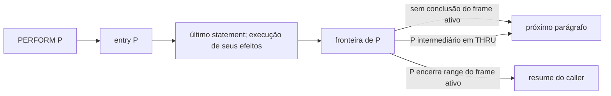

# D0 — F2 deep dive

## Conclusão e teste da hipótese

Os **46 F2** são explicados por uma abstração de conclusão de região que não atravessa uniformemente o contrato SP/lower. Há duas manifestações: frontier publicada conflitando com continuação ordinária dentro do statement, e frontier omitida enquanto a mesma continuação ordinária ainda é publicada. Não são 46 constructs desconhecidos e não são 46 defeitos independentes.

A hipótese literal “o frontend só tem um successor” é **refutada**: `Ast.Division` já guarda `normalContinuations`, `ordinaryContinuations` e `normalCompletionStatements`. O problema real é que a publicação/consumo volta a exigir um único significado para `normalContinuation`, misturando saída da região com destino de execução. `SourceOccurrence × ExecutionContext → OutcomeSet` descreve melhor a regra necessária, mas a topologia fonte pode permanecer finita e compartilhar os nós: contexto parametriza a resolução das fronteiras, não a identidade da ocorrência.

Uma fronteira é condicional à conclusão normal. Ela não prova terminação, não sobrepõe GO TO/GOBACK e não cria um edge que pula CALL/FILE/CICS. A mesma fronteira tem default ordinário, conclusão de range ativo ou continuação interna do THRU. A ausência de um valor exato não implica ausência desses outcomes estruturais.

## Cobertura empírica dos 46

A [matriz exigida](D0_F2_CLUSTER_MATRIX.csv) tem 1.964 pares site/parágrafo de 1.512 sites PERFORM em todos os 46 programas. [Detalhes por site](probes/f2-details.json) preservam fonte, AST, membership, frontier, target e regra. Nenhum programa foi escolhido por whitelist para esse inventário. A amostra profunda contém **14 programas reais / 24 casos de fronteira**. São 356 sites de range/THRU e 1.156 single-paragraph; dois têm repetição out-of-line explícita. Repetição inline envolvendo esses callers é dimensão adicional, presente nos witnesses CBEXPORT/COPAUS0C/CBTRN01C.

Dois predicados reais de `ProcedurePerformAdmission` explicam 2.170 ocorrências de rejeição enumeradas (uma ocorrência pode repetir pelo caller). Deduplicando programa/statement/regra, são 1.645: 593 “completion cannot override” e 1.052 “intrinsic stays in paragraph”. Todas as ocorrências ofensivas são `OBSERVED`: EXIT 1.174; SET 707; CONTINUE 215; ADD 30; DISPLAY 26; STRING 18. Isso não significa ausência de MOVE/CALL/CICS nos bodies; significa que essas variantes não são os offenders desses dois predicados.

Em 41 programas, a contagem coincide exatamente com stderr. Nos outros cinco o lower interrompe retenção após 100 diagnósticos (`IMPLEMENTATION_LIMIT`); a enumeração externa mostra o restante do mesmo predicado, não afirma que o lower tenha emitido esses diagnósticos. [Conferência](probes/f2-programs.json).

Clusters causais se sobrepõem; não somar as colunas como partição:

| Cluster | Programas | Mecanismo | Witness |
| --- | --- | --- | --- |
| K1_ROOT_EXIT | 28 | EXIT raiz é frontier e recebe fallback ordinário em normalContinuation | CBACT01C, CBACT02C |
| K2_ROOT_SEQUENTIAL | 8 | SET/ADD/DISPLAY/STRING/CONTINUE raiz terminal idem | CBEXPORT, COCRDUPC |
| K3_COMPOSED_FRONTIER | 17 | Filho de IF terminal é frontier e também aponta fora do parágrafo | COACTUPC, CBTRN02C |
| K4_UNPUBLISHED_FRONTIER | 32 | Falta frontier do filho/região; EVALUATE, IF implícito ou FILE handler ainda carrega edge ordinário | COPAUS1C, COBIL00C, COACCT01 |

| Programa físico | Sites | THRU/range | Repetidos | Clusters |
| --- | --- | --- | --- | --- |
| app/app-authorization-ims-db2-mq/cbl/COPAUA0C.cbl | 36 | 20 | 0 | K1_ROOT_EXIT, K2_ROOT_SEQUENTIAL, K3_COMPOSED_FRONTIER, K4_UNPUBLISHED_FRONTIER |
| app/app-authorization-ims-db2-mq/cbl/COPAUS0C.cbl | 44 | 0 | 0 | K3_COMPOSED_FRONTIER, K4_UNPUBLISHED_FRONTIER |
| app/app-authorization-ims-db2-mq/cbl/COPAUS1C.cbl | 34 | 0 | 0 | K4_UNPUBLISHED_FRONTIER |
| app/app-transaction-type-db2/cbl/COBTUPDT.cbl | 13 | 0 | 0 | K1_ROOT_EXIT |
| app/app-transaction-type-db2/cbl/COTRTUPC.cbl | 40 | 40 | 0 | K1_ROOT_EXIT, K2_ROOT_SEQUENTIAL, K3_COMPOSED_FRONTIER, K4_UNPUBLISHED_FRONTIER |
| app/app-vsam-mq/cbl/COACCT01.cbl | 32 | 0 | 1 | K3_COMPOSED_FRONTIER, K4_UNPUBLISHED_FRONTIER |
| app/app-vsam-mq/cbl/CODATE01.cbl | 28 | 0 | 1 | K3_COMPOSED_FRONTIER, K4_UNPUBLISHED_FRONTIER |
| app/cbl/CBACT01C.cbl | 34 | 0 | 0 | K1_ROOT_EXIT |
| app/cbl/CBACT02C.cbl | 9 | 0 | 0 | K1_ROOT_EXIT |
| app/cbl/CBACT03C.cbl | 9 | 0 | 0 | K1_ROOT_EXIT |
| app/cbl/CBCUS01C.cbl | 9 | 0 | 0 | K1_ROOT_EXIT |
| app/cbl/CBEXPORT.cbl | 40 | 0 | 0 | K2_ROOT_SEQUENTIAL |
| app/cbl/CBIMPORT.cbl | 28 | 0 | 0 | K2_ROOT_SEQUENTIAL |
| app/cbl/CBSTM03A.CBL | 25 | 2 | 0 | K1_ROOT_EXIT |
| app/cbl/CBTRN01C.cbl | 41 | 0 | 0 | K1_ROOT_EXIT, K4_UNPUBLISHED_FRONTIER |
| app/cbl/CBTRN02C.cbl | 60 | 0 | 0 | K1_ROOT_EXIT, K3_COMPOSED_FRONTIER |
| app/cbl/CBTRN03C.cbl | 71 | 0 | 0 | K1_ROOT_EXIT, K4_UNPUBLISHED_FRONTIER |
| app/cbl/COACTUPC.cbl | 61 | 61 | 0 | K1_ROOT_EXIT, K2_ROOT_SEQUENTIAL, K3_COMPOSED_FRONTIER, K4_UNPUBLISHED_FRONTIER |
| app/cbl/COACTVWC.cbl | 18 | 18 | 0 | K1_ROOT_EXIT, K3_COMPOSED_FRONTIER, K4_UNPUBLISHED_FRONTIER |
| app/cbl/COBIL00C.cbl | 38 | 0 | 0 | K4_UNPUBLISHED_FRONTIER |
| app/cbl/COCRDLIC.cbl | 27 | 23 | 0 | K1_ROOT_EXIT, K3_COMPOSED_FRONTIER, K4_UNPUBLISHED_FRONTIER |
| app/cbl/COCRDSLC.cbl | 19 | 19 | 0 | K1_ROOT_EXIT, K3_COMPOSED_FRONTIER, K4_UNPUBLISHED_FRONTIER |
| app/cbl/COCRDUPC.cbl | 26 | 26 | 0 | K1_ROOT_EXIT, K2_ROOT_SEQUENTIAL, K3_COMPOSED_FRONTIER, K4_UNPUBLISHED_FRONTIER |
| app/cbl/CORPT00C.cbl | 33 | 0 | 0 | K4_UNPUBLISHED_FRONTIER |
| app/cbl/COTRN00C.cbl | 38 | 0 | 0 | K4_UNPUBLISHED_FRONTIER |
| app/cbl/COTRN01C.cbl | 17 | 0 | 0 | K4_UNPUBLISHED_FRONTIER |
| app/cbl/COTRN02C.cbl | 61 | 0 | 0 | K4_UNPUBLISHED_FRONTIER |
| app/cbl/COUSR00C.cbl | 37 | 0 | 0 | K4_UNPUBLISHED_FRONTIER |
| samples/m2/unikix/UniKix_CardDemo_runtime_v1.zip!/migrated_app/cbl/CBACT01C.cbl | 10 | 0 | 0 | K1_ROOT_EXIT |
| samples/m2/unikix/UniKix_CardDemo_runtime_v1.zip!/migrated_app/cbl/CBACT02C.cbl | 9 | 0 | 0 | K1_ROOT_EXIT |
| samples/m2/unikix/UniKix_CardDemo_runtime_v1.zip!/migrated_app/cbl/CBACT03C.cbl | 9 | 0 | 0 | K1_ROOT_EXIT |
| samples/m2/unikix/UniKix_CardDemo_runtime_v1.zip!/migrated_app/cbl/CBCUS01C.cbl | 9 | 0 | 0 | K1_ROOT_EXIT |
| samples/m2/unikix/UniKix_CardDemo_runtime_v1.zip!/migrated_app/cbl/CBTRN01C.cbl | 41 | 0 | 0 | K1_ROOT_EXIT, K4_UNPUBLISHED_FRONTIER |
| samples/m2/unikix/UniKix_CardDemo_runtime_v1.zip!/migrated_app/cbl/CBTRN02C.cbl | 60 | 0 | 0 | K1_ROOT_EXIT, K3_COMPOSED_FRONTIER |
| samples/m2/unikix/UniKix_CardDemo_runtime_v1.zip!/migrated_app/cbl/CBTRN03C.cbl | 71 | 0 | 0 | K1_ROOT_EXIT, K4_UNPUBLISHED_FRONTIER |
| samples/m2/unikix/UniKix_CardDemo_runtime_v1.zip!/migrated_app/cbl/COACTUPC.cl2 | 61 | 61 | 0 | K1_ROOT_EXIT, K2_ROOT_SEQUENTIAL, K3_COMPOSED_FRONTIER, K4_UNPUBLISHED_FRONTIER |
| samples/m2/unikix/UniKix_CardDemo_runtime_v1.zip!/migrated_app/cbl/COACTVWC.cl2 | 18 | 18 | 0 | K1_ROOT_EXIT, K3_COMPOSED_FRONTIER, K4_UNPUBLISHED_FRONTIER |
| samples/m2/unikix/UniKix_CardDemo_runtime_v1.zip!/migrated_app/cbl/COBIL00C.cl2 | 38 | 0 | 0 | K4_UNPUBLISHED_FRONTIER |
| samples/m2/unikix/UniKix_CardDemo_runtime_v1.zip!/migrated_app/cbl/COCRDLIC.cl2 | 27 | 23 | 0 | K1_ROOT_EXIT, K3_COMPOSED_FRONTIER, K4_UNPUBLISHED_FRONTIER |
| samples/m2/unikix/UniKix_CardDemo_runtime_v1.zip!/migrated_app/cbl/COCRDSLC.cl2 | 19 | 19 | 0 | K1_ROOT_EXIT, K3_COMPOSED_FRONTIER, K4_UNPUBLISHED_FRONTIER |
| samples/m2/unikix/UniKix_CardDemo_runtime_v1.zip!/migrated_app/cbl/COCRDUPC.cl2 | 26 | 26 | 0 | K1_ROOT_EXIT, K2_ROOT_SEQUENTIAL, K3_COMPOSED_FRONTIER, K4_UNPUBLISHED_FRONTIER |
| samples/m2/unikix/UniKix_CardDemo_runtime_v1.zip!/migrated_app/cbl/CORPT00C.cl2 | 33 | 0 | 0 | K4_UNPUBLISHED_FRONTIER |
| samples/m2/unikix/UniKix_CardDemo_runtime_v1.zip!/migrated_app/cbl/COTRN00C.cl2 | 38 | 0 | 0 | K4_UNPUBLISHED_FRONTIER |
| samples/m2/unikix/UniKix_CardDemo_runtime_v1.zip!/migrated_app/cbl/COTRN01C.cl2 | 17 | 0 | 0 | K4_UNPUBLISHED_FRONTIER |
| samples/m2/unikix/UniKix_CardDemo_runtime_v1.zip!/migrated_app/cbl/COTRN02C.cl2 | 61 | 0 | 0 | K4_UNPUBLISHED_FRONTIER |
| samples/m2/unikix/UniKix_CardDemo_runtime_v1.zip!/migrated_app/cbl/COUSR00C.cl2 | 37 | 0 | 0 | K4_UNPUBLISHED_FRONTIER |

## Cadeia causal, por autoridade

1. `AstBuilder.completionRelations` constrói sucessor local por parágrafo e sucessor ordinário entre parágrafos; propaga saídas de IF/EVALUATE para seus filhos. Plain EXIT/CONTINUE e statements sequenciais têm conclusão normal reconhecida.
2. `ProcedurePerformSemantics` publica membership e completions. A extração de frontier em IF depende de explicit termination; em EVALUATE depende de `structureKnown`, que hoje também exige `inputComplete(unit)`. Mistura-se forma/control com disponibilidade de valores/entrada.
3. `CobolSemanticProductProjector.observedContinuation` usa o mapa local e, quando falta, faz fallback para ordinary em modeled/preserved statements não FILE. Assim EXIT, SET e outros OBSERVED recebem `normalContinuation=próximo parágrafo`.
4. A coleção separada `ordinaryContinuations` tem whitelist MOVE/IF/EVALUATE/PERFORM/procedure-PERFORM e é suprimida quando inputComplete é falso. MOVE terminal já tem tratamento específico de completion; CALL tem tratamento próprio. Essas exceções explicam por que witnesses sintéticos centrados em MOVE/CALL passam.
5. `ProcedurePerformAdmission` exige que uma completion não possua successor concreto, salvo CALL para fora; exige que toda continuação “intrinsic” fique no parágrafo, salvo o mesmo CALL. Portanto interpreta o fallback ordinário de OBSERVED como controle explícito incompatível com completion. A mensagem “explicit control” não transforma EXIT ou SET em transferência explícita.
6. O assembler pode substituir uma frontier pelo retorno da ativação, mas a admissão já recusou a unidade. Quando a frontier nem foi publicada (K4), relaxar só a admissão permitiria escape ordinário indevido. Portanto eliminar checks/aceitar qualquer successor não é solução.

Fontes de código: `proleap-poc/.../AstBuilder.java:530–657`, `ProcedurePerformSemantics.java:58,239`, `EvaluateSemantics.java:33`, `semanticproduct/projection/CobolSemanticProductProjector.java:218,469`; `cobol-lower/core/.../ProcedurePerformAdmission.java:42–55`, `PartialProgramAdmission.java:20–32,263`, `PartialProgramAssembler.java:40–43,95–129`. Todos sob `.positive-memory-topology`, pins em D0_BASELINE. O probe externo conserva IDs AST separados dos StatementIds SP; o join usa proveniência expandida, nunca igualdade de ID numérico.

## Semântica fonte usada no raciocínio independente

IBM Enterprise COBOL 6.4, [Language Reference](https://publibfp.dhe.ibm.com/epubs/pdf/igy6lr40.pdf), “Transfer of control” p.79, “Implicit scope terminators” p.294, “PERFORM” pp.413–424, “EVALUATE” pp.339–342 e “EXIT” pp.342–345. Execução ordinária segue a ordem fonte; término de procedimento performed retoma após o caller; THRU termina no último procedimento. EXIT simples é neutro. Um WHEN selecionado termina seu próprio escopo, sem queda para o WHEN seguinte. O apêndice A p.740 permite EXIT simples junto de outros statements; não excluir CBACT01C por aplicar a restrição do padrão antigo.

As tabelas abaixo são **esqueletos esperados derivados da fonte**, não CFG executado nem outputs corrigidos. “ctx” significa a ativação do caller indicado, condicionado a conclusão normal. Os trechos COBOL lidos e os fatos completos estão no [dossiê de fontes](probes/f2-source-dossier.md) e [JSON](probes/f2-witnesses.json). SP atual bloqueia antes de AIR nesses casos.

### CBACT01C

EXIT é neutro. A fronteira pertence ao término de 0000-ACCTFILE-OPEN; entrar ordinariamente e executar sob PERFORM exige destinos diferentes. CALLs de erro só retomam se retornarem; não criar bypass.

| Invoke edge esperado | Ocorrência real | Edge ordinário esperado | Edge em ctx esperado | AST observado | SP / conflito lower |
| --- | --- | --- | --- | --- | --- |
| statement:89 → entry statement:40 | statement:158 / CBACT01C.cbl:333 / EXIT | statement:158 → statement:44 | statement:158 → boundary → statement:90 | local=None; ordinary AST=746; completes=True | frontier=True; next=statement:44 |

O lower rejeita o edge externo como intrinsic; quando frontier=true, também rejeita a possibilidade de conclusão contextual. Quando false, falta a conclusão do filho/região no contrato consumido, apesar de o AST reconhecer a conclusão normal do statement; CBTRN01C já publica a frontier do READ pai, mas o consumer não compõe seu handler.

### CBACT02C

Mesmo mecanismo com ADD no parágrafo seguinte: a aritmética desse ADD não é premissa para reconhecer o término do parágrafo chamado.

| Invoke edge esperado | Ocorrência real | Edge ordinário esperado | Edge em ctx esperado | AST observado | SP / conflito lower |
| --- | --- | --- | --- | --- | --- |
| statement:31 → entry statement:5 | statement:49 / CBACT02C.cbl:134 / EXIT | statement:49 → statement:50 | statement:49 → boundary → statement:32 | local=None; ordinary AST=188; completes=True | frontier=True; next=statement:50 |

O lower rejeita o edge externo como intrinsic; quando frontier=true, também rejeita a possibilidade de conclusão contextual. Quando false, falta a conclusão do filho/região no contrato consumido, apesar de o AST reconhecer a conclusão normal do statement; CBTRN01C já publica a frontier do READ pai, mas o consumer não compõe seu handler.

### COACTUPC

O THRU cruza fronteiras intermediárias por default; só a última fronteira devolve ao caller. DFHAID ausente impede provar valores de WHEN, mas não apaga a delimitação explícita END-EVALUATE. IF final tem frontier composta; STRING em um WHEN não entra no WHEN seguinte. O copybook CSUTLDPY fornece um range de 12 parágrafos, não uma única operação.

| Invoke edge esperado | Ocorrência real | Edge ordinário esperado | Edge em ctx esperado | AST observado | SP / conflito lower |
| --- | --- | --- | --- | --- | --- |
| statement:858 → entry statement:1283 | statement:1284 / CSSTRPFY.cpy:23 / SET CCARD-AID-ENTER TO TRUE | statement:1284 → statement:1312 | statement:1284 → boundary → statement:1312 | local=None; ordinary AST=9977; completes=True | frontier=False; next=statement:1312 |
| statement:858 → entry statement:1283 | statement:1312 / CSSTRPFY.cpy:81 / EXIT | statement:1312 → statement:819 | statement:1312 → boundary → statement:859 | local=None; ordinary AST=9980; completes=True | frontier=True; next=statement:819 |
| statement:886 → entry statement:902 | statement:943 / COACTUPC.cbl:1672 / CONTINUE | statement:943 → statement:945 | statement:943 → boundary → statement:945 | local=None; ordinary AST=4786; completes=True | frontier=True; next=statement:945 |
| statement:916 → entry statement:1317 | statement:1317 / CSUTLDPY.cpy:19 / SET WS-EDIT-DATE-IS-INVALID   TO TRUE | statement:1317 → statement:1318 | statement:1317 → boundary → statement:1318 | local=None; ordinary AST=10005; completes=True | frontier=True; next=statement:1318 |
| statement:1210 → entry statement:1218 | statement:1222 / COACTUPC.cbl:3674 / STRING 'Account:' WS-CARD-RID-ACCT-ID-X ' not found in' ' Cross ref file.  Resp:' ERROR-RESP '  | statement:1222 → statement:1225 | statement:1222 → boundary → statement:1225 | local=None; ordinary AST=8900; completes=True | frontier=False; next=statement:1225 |

O lower rejeita o edge externo como intrinsic; quando frontier=true, também rejeita a possibilidade de conclusão contextual. Quando false, falta a conclusão do filho/região no contrato consumido, apesar de o AST reconhecer a conclusão normal do statement; CBTRN01C já publica a frontier do READ pai, mas o consumer não compõe seu handler.

### COCRDUPC

O GO TO 1230-EDIT-NAME-EXIT é transferência explícita e deve ser preservado. O SET final chega ao mesmo EXIT por conclusão normal. Esses dois motivos não são intercambiáveis; no THRU a fronteira intermediária continua até o EXIT final.

| Invoke edge esperado | Ocorrência real | Edge ordinário esperado | Edge em ctx esperado | AST observado | SP / conflito lower |
| --- | --- | --- | --- | --- | --- |
| statement:306 → entry statement:333 | statement:344 / COCRDUPC.cbl:839 / SET FLG-CARDNAME-ISVALID     TO TRUE | statement:344 → statement:345 | statement:344 → boundary → statement:345 | local=None; ordinary AST=2015; completes=True | frontier=True; next=statement:345 |

O lower rejeita o edge externo como intrinsic; quando frontier=true, também rejeita a possibilidade de conclusão contextual. Quando false, falta a conclusão do filho/região no contrato consumido, apesar de o AST reconhecer a conclusão normal do statement; CBTRN01C já publica a frontier do READ pai, mas o consumer não compõe seu handler.

### CBEXPORT

DISPLAY, STRING e ADD completam normalmente sem exigir seus valores exatos. PERFORM 133 está dentro de PERFORM UNTIL: seu retorno de linguagem é o PERFORM 2100-READ-CUSTOMER-RECORD da linha 251, apesar de o resume concreto estar UNAVAILABLE no SP. O laço testa novamente sua condição; não retorna para 3000-EXPORT-ACCOUNTS a cada ADD.

| Invoke edge esperado | Ocorrência real | Edge ordinário esperado | Edge em ctx esperado | AST observado | SP / conflito lower |
| --- | --- | --- | --- | --- | --- |
| statement:94 → entry statement:102 | statement:106 / CBEXPORT.cbl:169 / DISPLAY 'CBEXPORT: Export Time: ' WS-EXPORT-TIME | statement:106 → statement:107 | statement:106 → boundary → statement:95 | local=None; ordinary AST=436; completes=True | frontier=True; next=statement:107 |
| statement:103 → entry statement:107 | statement:111 / CBEXPORT.cbl:191 / STRING WS-EXPORT-DATE ' ' WS-EXPORT-TIME '.00' DELIMITED BY SIZE INTO WS-FORMATTED-TIMESTAMP EN | statement:111 → statement:112 | statement:111 → boundary → statement:104 | local=None; ordinary AST=481; completes=True | frontier=True; next=statement:112 |
| statement:133 → entry statement:139 | statement:145 / CBEXPORT.cbl:310 / ADD 1 TO WS-TOTAL-RECORDS-EXPORTED | statement:145 → statement:146 | statement:145 → boundary → PERFORM 2100-READ-CUSTOMER-RECORD, fonte linha 251 | local=None; ordinary AST=711; completes=True | frontier=True; next=statement:146 |

O lower rejeita o edge externo como intrinsic; quando frontier=true, também rejeita a possibilidade de conclusão contextual. Quando false, falta a conclusão do filho/região no contrato consumido, apesar de o AST reconhecer a conclusão normal do statement; CBTRN01C já publica a frontier do READ pai, mas o consumer não compõe seu handler.

### COACCT01

No WHEN MQCC-OK, SET completa o EVALUATE e o parágrafo. O ADD no THEN final de 3000-GET-REQUEST também completa o parágrafo; a ausência dos COPYs MQ não transforma um branch em salto ao próximo WHEN. Há chamada aninhada de 4000 e repetição no programa.

| Invoke edge esperado | Ocorrência real | Edge ordinário esperado | Edge em ctx esperado | AST observado | SP / conflito lower |
| --- | --- | --- | --- | --- | --- |
| statement:136 → entry statement:26 | statement:158 / COACCT01.cbl:314 / SET  ERR-QUEUE-OPEN   TO TRUE | statement:158 → statement:161 | statement:158 → boundary → statement:137 | local=None; ordinary AST=559; completes=True | frontier=False; next=statement:161 |
| statement:143 → entry statement:37 | statement:166 / COACCT01.cbl:375 / ADD  1                 TO MQ-MSG-COUNT | statement:166 → statement:60 | statement:166 → boundary → statement:144 | local=None; ordinary AST=692; completes=True | frontier=True; next=statement:60 |

O lower rejeita o edge externo como intrinsic; quando frontier=true, também rejeita a possibilidade de conclusão contextual. Quando false, falta a conclusão do filho/região no contrato consumido, apesar de o AST reconhecer a conclusão normal do statement; CBTRN01C já publica a frontier do READ pai, mas o consumer não compõe seu handler.

### COPAUS0C

SET no ELSE final de PROCESS-PF7-KEY e CONTINUE no WHEN OTHER de POPULATE-AUTH-LIST completam regiões distintas. O caller 300 está no IF dentro de PERFORM UNTIL: após retorno, a linguagem executa COMPUTE WS-IDX = WS-IDX + 1 (linha 432), depois o restante do corpo/teste. O SP não publica esse resume.

| Invoke edge esperado | Ocorrência real | Edge ordinário esperado | Edge em ctx esperado | AST observado | SP / conflito lower |
| --- | --- | --- | --- | --- | --- |
| statement:271 → entry statement:238 | statement:291 / COPAUS0C.cbl:383 / SET SEND-ERASE-NO            TO TRUE | statement:291 → statement:239 | statement:291 → boundary → statement:272 | local=None; ordinary AST=2633; completes=True | frontier=True; next=statement:239 |
| statement:300 → entry statement:63 | statement:319 / COPAUS0C.cbl:604 / CONTINUE | statement:319 → statement:320 | statement:319 → boundary → COMPUTE WS-IDX, fonte linha 432 | local=None; ordinary AST=3141; completes=True | frontier=False; next=statement:320 |

O lower rejeita o edge externo como intrinsic; quando frontier=true, também rejeita a possibilidade de conclusão contextual. Quando false, falta a conclusão do filho/região no contrato consumido, apesar de o AST reconhecer a conclusão normal do statement; CBTRN01C já publica a frontier do READ pai, mas o consumer não compõe seu handler.

### COPAUS1C

WHEN SEGMENT-NOT-FOUND / WHEN END-OF-DB compartilham um corpo; não são dois arms com queda entre eles. SET do WHEN STATUS-OK sai do EVALUATE terminal e retorna ao caller se esse parágrafo foi performed.

| Invoke edge esperado | Ocorrência real | Edge ordinário esperado | Edge em ctx esperado | AST observado | SP / conflito lower |
| --- | --- | --- | --- | --- | --- |
| statement:131 → entry statement:159 | statement:168 / COPAUS1C.cbl:474 / SET AUTHS-NOT-EOF              TO TRUE | statement:168 → statement:172 | statement:168 → boundary → statement:98 | local=None; ordinary AST=1794; completes=True | frontier=False; next=statement:172 |

O lower rejeita o edge externo como intrinsic; quando frontier=true, também rejeita a possibilidade de conclusão contextual. Quando false, falta a conclusão do filho/região no contrato consumido, apesar de o AST reconhecer a conclusão normal do statement; CBTRN01C já publica a frontier do READ pai, mas o consumer não compõe seu handler.

### COBIL00C

O CICS READ precede EVALUATE WS-RESP-CD. Mesmo com efeito externo parcial, o CONTINUE do WHEN NORMAL termina o braço; a sucessão estrutural não exige conhecer RESP runtime.

| Invoke edge esperado | Ocorrência real | Edge ordinário esperado | Edge em ctx esperado | AST observado | SP / conflito lower |
| --- | --- | --- | --- | --- | --- |
| statement:127 → entry statement:150 | statement:152 / COBIL00C.cbl:358 / CONTINUE | statement:152 → statement:156 | statement:152 → boundary → statement:18 | local=None; ordinary AST=1063; completes=True | frontier=False; next=statement:156 |

O lower rejeita o edge externo como intrinsic; quando frontier=true, também rejeita a possibilidade de conclusão contextual. Quando false, falta a conclusão do filho/região no contrato consumido, apesar de o AST reconhecer a conclusão normal do statement; CBTRN01C já publica a frontier do READ pai, mas o consumer não compõe seu handler.

### COTRTUPC

SET no THEN do IF terminal e SET/nested IF do ELSE convergem no término do primeiro parágrafo do THRU, depois o EXIT final retorna ao caller. A condição composta não precisa de valor exato para preservar os dois outcomes.

| Invoke edge esperado | Ocorrência real | Edge ordinário esperado | Edge em ctx esperado | AST observado | SP / conflito lower |
| --- | --- | --- | --- | --- | --- |
| statement:157 → entry statement:101 | statement:196 / COTRTUPC.cbl:602 / SET PFK-VALID                  TO TRUE | statement:196 → statement:199 | statement:196 → boundary → statement:199 | local=None; ordinary AST=1489; completes=True | frontier=True; next=statement:199 |

O lower rejeita o edge externo como intrinsic; quando frontier=true, também rejeita a possibilidade de conclusão contextual. Quando false, falta a conclusão do filho/região no contrato consumido, apesar de o AST reconhecer a conclusão normal do statement; CBTRN01C já publica a frontier do READ pai, mas o consumer não compõe seu handler.

### COPAUA0C

THRU 1000-INITIALIZE/1000-EXIT contém PERFORMs aninhados de MQ; o EXIT final devolve ao caller externo, não reinicia 1100. A fronteira do EVALUATE após CICS READ e STRING terminal de 6000 têm a mesma regra contextual, com efeitos parciais.

| Invoke edge esperado | Ocorrência real | Edge ordinário esperado | Edge em ctx esperado | AST observado | SP / conflito lower |
| --- | --- | --- | --- | --- | --- |
| statement:185 → entry statement:189 | statement:192 / COPAUA0C.cbl:250 / EXIT | statement:192 → statement:3 | statement:192 → boundary → statement:186 | local=None; ordinary AST=588; completes=True | frontier=True; next=statement:3 |
| statement:229 → entry statement:33 | statement:240 / COPAUA0C.cbl:489 / SET  CARD-FOUND-XREF  TO TRUE | statement:240 → statement:249 | statement:240 → boundary → statement:249 | local=None; ordinary AST=1057; completes=True | frontier=False; next=statement:249 |
| statement:234 → entry statement:72 | statement:292 / COPAUA0C.cbl:722 / STRING PA-RL-CARD-NUM         ',' PA-RL-TRANSACTION-ID   ',' PA-RL-AUTH-ID-CODE     ',' PA-RL-A | statement:292 → statement:293 | statement:292 → boundary → statement:293 | local=None; ordinary AST=1460; completes=True | frontier=True; next=statement:293 |

O lower rejeita o edge externo como intrinsic; quando frontier=true, também rejeita a possibilidade de conclusão contextual. Quando false, falta a conclusão do filho/região no contrato consumido, apesar de o AST reconhecer a conclusão normal do statement; CBTRN01C já publica a frontier do READ pai, mas o consumer não compõe seu handler.

### CBTRN02C

CONTINUE do THEN do IF terminal completa 2700-A; no ELSE os PERFORMs de erro precisam completar antes da mesma fronteira. WRITE e seus resultados desconhecidos não autorizam eliminar o braço nem inventar retorno de ABEND.

| Invoke edge esperado | Ocorrência real | Edge ordinário esperado | Edge em ctx esperado | AST observado | SP / conflito lower |
| --- | --- | --- | --- | --- | --- |
| statement:271 → entry statement:274 | statement:277 / CBTRN02C.cbl:518 / CONTINUE | statement:277 → statement:281 | statement:277 → boundary → statement:273 | local=None; ordinary AST=950; completes=True | frontier=True; next=statement:281 |

O lower rejeita o edge externo como intrinsic; quando frontier=true, também rejeita a possibilidade de conclusão contextual. Quando false, falta a conclusão do filho/região no contrato consumido, apesar de o AST reconhecer a conclusão normal do statement; CBTRN01C já publica a frontier do READ pai, mas o consumer não compõe seu handler.

### CBTRN01C

READ terminal tem INVALID KEY e NOT INVALID KEY. DISPLAY130 termina o handler de sucesso; a conclusão do READ125 já está publicada como frontier, mas a do filho não é composta pelo consumer. Em PERFORM107 o retorno de linguagem é IF WS-XREF-READ-STATUS = 0, linha 173, dentro do laço inline; SP resume UNAVAILABLE. Não há INPUT_MISSING: é limite de composição FILE.

| Invoke edge esperado | Ocorrência real | Edge ordinário esperado | Edge em ctx esperado | AST observado | SP / conflito lower |
| --- | --- | --- | --- | --- | --- |
| statement:107 → entry statement:9 | statement:130 / CBTRN01C.cbl:238 / DISPLAY 'CUSTOMER ID: ' XREF-CUST-ID | statement:130 → statement:11 | statement:130 → boundary → IF WS-XREF-READ-STATUS, fonte linha 173 | local=None; ordinary AST=470; completes=True | frontier=False; next=statement:11 |

O lower rejeita o edge externo como intrinsic; quando frontier=true, também rejeita a possibilidade de conclusão contextual. Quando false, falta a conclusão do filho/região no contrato consumido, apesar de o AST reconhecer a conclusão normal do statement; CBTRN01C já publica a frontier do READ pai, mas o consumer não compõe seu handler.

### CBTRN03C

O IF externo termina por ponto na linha 243, enquanto apenas o IF interno tem END-IF. DISPLAY169 no THEN termina a região externa e o parágrafo. ProcedurePerformSemantics exige explicitlyTerminated para coletar essa frontier e a omite; não há INPUT_MISSING. O retorno de PERFORM143 é statement144; ordinary segue statement173.

| Invoke edge esperado | Ocorrência real | Edge ordinário esperado | Edge em ctx esperado | AST observado | SP / conflito lower |
| --- | --- | --- | --- | --- | --- |
| statement:143 → entry statement:167 | statement:169 / CBTRN03C.cbl:232 / DISPLAY 'Reporting from ' WS-START-DATE ' to ' WS-END-DATE | statement:169 → statement:173 | statement:169 → boundary → statement:144 | local=None; ordinary AST=525; completes=True | frontier=False; next=statement:173 |

O lower rejeita o edge externo como intrinsic; quando frontier=true, também rejeita a possibilidade de conclusão contextual. Quando false, falta a conclusão do filho/região no contrato consumido, apesar de o AST reconhecer a conclusão normal do statement; CBTRN01C já publica a frontier do READ pai, mas o consumer não compõe seu handler.

## Um desenho que evita confundir successors

Não são três edges incondicionais em um CFG comum. A regra de resolução depende do contexto e precisa ser consumida com matching, seja por especialização explícita ou por mecanismo local suportado. IF/EVALUATE terminais apontam para a mesma boundary pelos outcomes de conclusão de seus braços; GO TO continua tendo destino explícito.

## Falsificadores e alcance

- CALL/MOVE terminal são controles de contraste: o desenho atual já os trata de forma especial; isso refuta que todo statement seja incapaz de retorno contextual.
- THRU de COACTUPC/COCRDUPC refuta uma correção “todo EXIT retorna sempre”. Entrada ordinária de CBACT01C refuta “sempre remover fallthrough”.
- CBEXPORT e COPAUS0C mostram resumes subordinados que continuam ausentes no SP; zerar os 2.170 predicados não garante execução fiel nem produto final.
- Quatro programas K4 (CBTRN01C e CBTRN03C, checkout+ZIP) não têm INPUT_MISSING: FILE handler e IF de terminação implícita são lacunas independentes. Nos outros 28 K4 existe INPUT_MISSING; isso não autoriza atribuir todo gap do programa apenas ao COPY.
- COPYs incompletos podem esconder estrutura: só publicar o que tiver prova local e explicitar bounds; não inferir frontier de ProgramPoint, regex ou posição física no lower.
- A presença de CICS, FILE, CALL, IF, GO TO, repetition e callers múltiplos foi inventariada na matriz completa. Eles compõem as regiões, não são todos a origem do primeiro erro F2.

A solução comum é uma autoridade de **outcomes tipados e fronteiras de região**, com proveniência e dependências de prova. A/B/C são comparadas sobre os mesmos witnesses nos três documentos de arquitetura. Não foi implementado fix nem demonstrado PASS após mudança hipotética. O conhecimento atual basta para rejeitar novas exceções por verbo como estratégia arquitetural.
